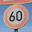
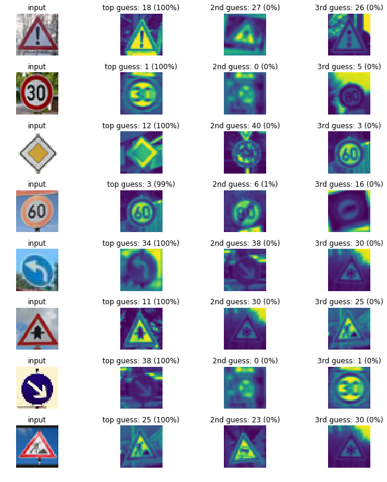
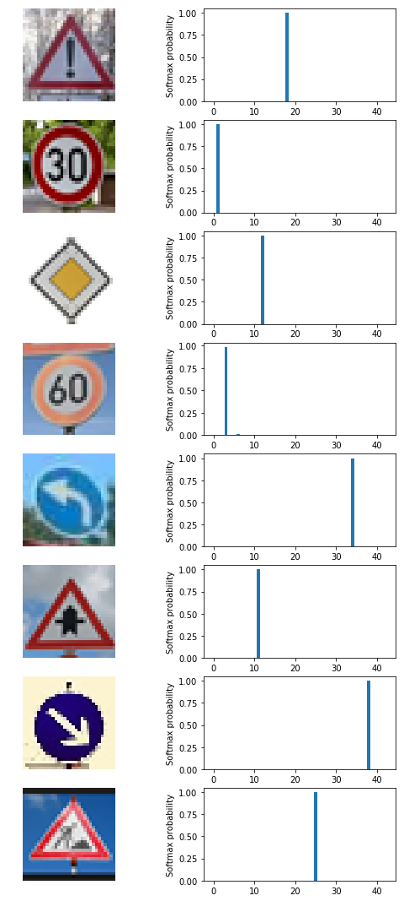

# Traffic Sign Classification using CNNs

In this project I have used Python3,Numpy,Matplotlib,OpenCV,sklearn,Pickle,Tensorflow to build and train a Convolutional Neural Network that can
classify traffic sign from a given image with 95% accuracy. I have used the following approach to build this classifier

1. Loaded the German Traffic signs image dataset as train and test numpy arrays with labels.
2. Explored the dataset using numpy and matplotlib to find the number of unique classes, number of training and testing observations, 
   dimensions of the images and to get a visual feel of the images.
3. Plotted the distribution of images based on the output classes to find how the data is distributed.
4. Pre-processed the dataset by converting the images to grayscale and normalizing them such that they have zero mean and equal variance
5. From the distribution of images, I observed that the data for some classes is far too less compared to other classes, hence I have 
   augmented the dataset to generate some fake images from the existing images by doing some random scaling, translation, rotation, 
   increasing brightness and smoothing the images.
6. After adding the augmented data to the original dataset shuffled the dataset and split them into training and validation sets using sklearn
7. Saved the dataset to disk using pickle to avoid regenerating the augmented data.
8. Randomly checked the images after pre-processing and plotted the distribution.
9. Designed the Convolutional Neural Network with multiple Convolution, pooling and fully connected layers.
10. Experimented with multiple architectures, dropout, multiple kernel sizes, different types of padding and trained with different combinations
    of Epochs, batchsizes and learning rates.
11. Arrived at a working design with optimal hyper parameters that gave a training accuracy of 99% and Testing accuracy of 95%
12. Tested the model on new images found on web.

## Details of the approach and further explanation of steps

In this section I provide further details about each of the above steps and the reasoning behind them

### Data Set Summary & Exploration

I used numpy to explore the dataset. This Pickle dataset is a dictionary with key value pairs. 
1. **features** key contains the images as values in 4D array in pixels of dimesions (**num.of observations**X**width**X**height**X**color channels**)
2. **labels** key contains the classification of the traffic sign as values in 2D array of dimensions (**num.of observations**X**class**)

As the original validation set given in the dataset is less than 20% of the training set, I have put it back into training set and had
later split the training and validation set to keep them in the raio of 80:20

```
X_train_orig, y_train_orig = train['features'], train['labels']
X_valid_orig, y_valid_orig = valid['features'], valid['labels']
#Concatenating Training and validation data as the original validation data is less than 20% of training data
X_train = np.concatenate((X_train_orig,X_valid_orig))
y_train = np.concatenate((y_train_orig,y_valid_orig))
```

```
n_train = len(y_train)
n_test = len(y_test)
image_shape = X_train.shape
n_classes = len(np.unique(y_train))
```

Number of training examples = 39209   
Number of testing examples = 12630  
Image data shape = (39209, 32, 32, 3)  
Number of classes = 43  

Here is a visualization of a sample image from each class achieved using the following code snippet

```
import matplotlib.pyplot as plt
%matplotlib inline

num_of_samples=[]
plt.figure(figsize=(10, 16.5))
for i in range(0, n_classes):
    plt.subplot(11, 4, i+1)
    x_select = X_train[y_train == i]
    plt.imshow(x_select[0, :, :, :]) #draw the first image of each class
    plt.title(i)
    plt.axis('off')
    num_of_samples.append(len(x_select))
plt.show()
```


Here is the distribution of training images based on the output classes achieved using the following code snippet

```
plt.figure(figsize=(12, 4))
plt.bar(range(0, n_classes), num_of_samples)
plt.title("Distribution of the train dataset")
plt.xlabel("Class number")
plt.ylabel("Number of images")
plt.show()
```


### Design and Test a Model Architecture

#### 1. How I preprocessed the image data. What techniques were chosen and why did I chose these techniques? 

Images from the sample dataset are in color (have all three dimensions RGB), I have converted them to gray scale as it will reduce the
memory requirement and also speed up the training without loosing any needed details. 

After converting them to gray scale, I have normalized the data by substracting 128 from each pixel value and dividing it by 128. This will ensure that the all the features in the input will have zero mean and equal variance.

Few advantages of normalizing the data are:

1. It makes your training faster.
2. It prevents you from getting stuck in local optima.

```
# Convert to grayscale
X_train_rgb = X_train
X_train_gry = np.sum(X_train/3, axis=3, keepdims=True)

X_test_rgb = X_test
X_test_gry = np.sum(X_test/3, axis=3, keepdims=True)

X_train = X_train_gry
X_test = X_test_gry

#Normalize
X_train_norm = (X_train - 128)/128
X_test_norm = (X_test -128)/128
```
Here is an example of a traffic sign image before and after grayscaling.


From the distribution of images, I observed that the data for some classes is far too less compared to other classes, hence I have augmented the dataset to generate some fake images from the existing images by doing some random scaling, translation, rotation, increasing brightness and smoothing the images.

```
def random_translate(img):
    """Applies translation up to px pixels in x and y directions"""
    rows,cols,_ = img.shape
    px = 2
    dx,dy = np.random.randint(-px,px,2)
    A = np.float32([[1,0,dx],[0,1,dy]])
    img_trns = cv2.warpAffine(img,A,(cols,rows))
    img_trns = img_trns[:,:,np.newaxis]
    return img_trns

def random_scale(img):
    """Scales image up to px pixels in x and y directions"""
    rows,cols,_ = img.shape
    # Pixel limits to transform
    px = np.random.randint(-2,2)
    # End Co-ordinates
    crds1 = np.float32([[px,px],[rows-px,px],[px,cols-px],[rows-px,cols-px]])
    # Starting Co-ordinates
    crds2 = np.float32([[0,0],[rows,0],[0,cols],[rows,cols]])
    P = cv2.getPerspectiveTransform(crds1,crds2)
    img_scl = cv2.warpPerspective(img,P,(rows,cols))
    img_scl = img_scl[:,:,np.newaxis]
    return img_scl

def gaussian_blur(img, kernel_size=3):
    """Applies a Gaussian Noise kernel"""
    img_smt = cv2.GaussianBlur(img, (kernel_size, kernel_size), 0)
    img_smt = img_smt[:,:,np.newaxis]
    return img_smt

def random_rotate(img):
    """Rotates image up to ang degrees """
    c_x,c_y = int(img.shape[0]/2), int(img.shape[1]/2)
    ang = 30.0*np.random.rand()-15
    R = cv2.getRotationMatrix2D((c_x, c_y), ang, 1.0)
    img_rot = cv2.warpAffine(img, R, img.shape[:2])
    img_rot = img_rot[:,:,np.newaxis]
    return img_rot

def random_brightness(img):
    shifted = img + 1.0   # shift to (0,2) range
    img_max_value = max(shifted.flatten())
    max_coef = 2.0/img_max_value
    min_coef = max_coef - 0.1
    coef = np.random.uniform(min_coef, max_coef)
    img_brgt = shifted * coef - 1.0
    return img_brgt

def random_warp(img):
    rows,cols,_ = img.shape
    # random scaling coefficients
    rndx = np.random.rand(3) - 0.5
    rndx *= cols * 0.06   # this coefficient determines the degree of warping
    rndy = np.random.rand(3) - 0.5
    rndy *= rows * 0.06
    # 3 starting points for transform, 1/4 way from edges
    x1 = cols/4
    x2 = 3*cols/4
    y1 = rows/4
    y2 = 3*rows/4
    pts1 = np.float32([[y1,x1],
                       [y2,x1],
                       [y1,x2]])
    pts2 = np.float32([[y1+rndy[0],x1+rndx[0]],
                       [y2+rndy[1],x1+rndx[1]],
                       [y1+rndy[2],x2+rndx[2]]])
    M = cv2.getAffineTransform(pts1,pts2)
    img_warp = cv2.warpAffine(img,M,(cols,rows))
    img_warp = img_warp[:,:,np.newaxis]
    return img_warp

def augment_img(img):
    """Image augumentation pipeline """
    img=random_translate(img)
    img=random_scale(img)
    img=random_rotate(img)
    img=random_brightness(img)
    img=random_warp(img)
    img_aug=gaussian_blur(img)
    return img_aug
 ```

One more reason why I wanted to infuse additional data into the dataset is to achieve the **Translation**, **Rotation**, **Size** and 
**Illumination** variance

Here is a comparison of gray scale image and augmented image


Here is how the distribution looks like after infusing augmented data


With all the pre-processing and data augmentation done, I now split the data into training and validation sets after shuffling

```
from sklearn.utils import shuffle
X_train, y_train = shuffle(X_train, y_train)
print('done')
```
```
print("Old X_train size:",len(X_train))
from sklearn.model_selection import train_test_split
X_train, X_valid, y_train, y_valid = train_test_split(X_train, y_train, 
                                                                test_size=0.20, random_state=42)
print("New X_train size:",len(X_train))
print("X_validation size:",len(X_valid))
```
Old X_train size: 54710   
New X_train size: 43768   
X_validation size: 10942   

```
print(np.mean(X_train))
print(np.mean(X_test))
print(np.mean(X_valid))
print(X_train.shape)
print(X_test.shape)
print(X_valid.shape)
print(y_train.shape)
```

-0.282008280784   
-0.358215153428    
-0.283820187786   
(43768, 32, 32, 1)   
(12630, 32, 32, 1)   
(10942, 32, 32, 1)   
(43768,)   

Since generating this additional data is a time consuming process and I didn't want to do this step every time I restart the notebook. Hence I have saved this data to disk using the following code.

```
aug_train = {'features': X_train,
             'labels': y_train}
aug_val = {'features': X_valid,
             'labels': y_valid}
aug_test = {'features': X_test,
             'labels': y_test}
pickle.dump(aug_train, open( "./my-augmented-data/aug_train1.p", "wb" ) )
pickle.dump(aug_val, open( "./my-augmented-data/aug_val1.p", "wb" ) )
pickle.dump(aug_test, open( "./my-augmented-data/aug_test1.p", "wb" ) )

print('done')
```

#### 2. Description of the final CNN model architecture

Here is a modified version of LeNet Architecture that I had adapted in this project. Taken from  

Initially I started with the same LeNet Architecture that was shown in the LeNet lab. This has worked fine and was giving a training 
accuracy of 96% and testing accuracy of 94.1%. To further improve it, I had adapted this architecture from Sermanet/LeCunn traffic sign classification journal article.


Here is a description of each layer in this model

|Layer             | Description                                |
|------------------|:------------------------------------------:|
|Input             | 32x32x1 gray scale image                   |
|Convolution 5x5   | 1x1 stride, Valid padding, output 28x28x6  |
|ReLU Activation   | ReLU Activation unit, output 28x28x6       |
|Max Pooling       | 2x2 stride, Valid padding, output 14x14x6  |
|Convolution 5x5   | 1x1 stride, Valid padding, output 10x10x16 |
|ReLU Activation   | ReLU Activation unit, output 10x10x16      |
|Max Pooling       | 2x2 stride, Valid padding, output 5x5x16   |
|Convolution 5x5   | 1x1 stride, Valid padding, output 1x1x400  |
|ReLU Activation   | ReLU Activation unit, output 1x1x400       |
|Flatten layer     | Flatten Relu output layer 1x1x400 and Max Pooling layer with output 5x5x16.|
|Concatenate layer | Concatenate flattened layers to a single layer, output 800 |
|Dropout layer     | Dropout with a keep probability of 0.5 for training 1.0 for testing |
|Fully connected layer| Fully connected layer with logits output 800x43 |

```
from tensorflow.contrib.layers import flatten

def LeNet(x):    
    # Arguments used for tf.truncated_normal, randomly defines variables for the weights and biases for each layer
    mu = 0
    sigma = 0.1
    
    weights = {'wc1': tf.Variable(tf.random_normal([5, 5, 1, 6],mean=mu,stddev=sigma)),
               'wc2': tf.Variable(tf.random_normal([5, 5, 6, 16],mean=mu,stddev=sigma)),
               'wc3': tf.Variable(tf.random_normal([5, 5, 16, 400],mean=mu,stddev=sigma)),
               'wfc':tf.Variable(tf.random_normal([800,43],mean=mu,stddev=sigma)),
               }
    biases = {'bc1':tf.Variable(tf.zeros(6)),
              'bc2':tf.Variable(tf.zeros(16)),
              'bc3':tf.Variable(tf.zeros(400)),
              'bfc':tf.Variable(tf.zeros(43))}
    
    # TODO: Layer 1: Convolutional. Input = 32x32x1. Output = 28x28x6.
    conv1 = tf.nn.conv2d(x,weights['wc1'],strides=[1,1,1,1],padding='VALID')+biases['bc1']

    # TODO: Activation.
    conv1 = tf.nn.relu(conv1)
    
    # TODO: Pooling. Input = 28x28x6. Output = 14x14x6.
    conv1 = tf.nn.max_pool(conv1,ksize=[1,2,2,1],strides=[1,2,2,1],padding='VALID')
    

    # TODO: Layer 2: Convolutional. Input = 14x14x6. Output = 10x10x16.
    conv2 = tf.nn.conv2d(conv1,weights['wc2'],strides=[1,1,1,1],padding='VALID')+biases['bc2']
    
    # TODO: Activation.
    conv2 = tf.nn.relu(conv2)

    # TODO: Pooling. Input = 10x10x16. Output = 5x5x16.
    conv2 = tf.nn.max_pool(conv2,ksize=[1,2,2,1],strides=[1,2,2,1],padding='VALID')  
    
    # TODO: Layer 3: Convolutional. Input = 5x5x16. Output = 1x1x400.
    conv3 = tf.nn.conv2d(conv2,weights['wc3'],strides=[1,1,1,1],padding='VALID')+biases['bc3']
    
    # TODO: Activation.
    conv3 = tf.nn.relu(conv3)
    
    # TODO: Flatten Layer2. Input = 5x5x16. Output = 400.
    conv2_flat = flatten(conv2)
    
    # TODO: Flatten Layer 3. Input = 1x1x400. Output = 400.
    conv3_flat = flatten(conv3)
    
    # Concat Flattened layer2 and Layer3 and . Input = 400 + 400. Output = 800
    concat_layer2_layer3 = tf.concat_v2([conv3_flat, conv2_flat], 1)
    
    # Dropout
    concat_layer2_layer3 = tf.nn.dropout(concat_layer2_layer3, keep_prob)
    

    # TODO: Layer 4: Fully Connected. Input = 800. Output = 43.
    logits = tf.add(tf.matmul(concat_layer2_layer3,weights['wfc']),biases['bfc'])
    
    return logits
```

#### 3. Description of how I trained my model
 
I used the Adam optimizer. The final settings used were:
* batch size: 96
* epochs: 60
* learning rate: 0.0009
* mu: 0
* sigma: 0.1
* dropout keep probability: 0.5

#### 4. What approach did I take in coming up with a solution to this problem?

I have tried multiple batch sizes ranging from 32 to 128 in increments of 32 and epochs ranging from 10 to 100 and learning rate ranging 
from 0.001 to 0.0001 and experimented with multiple keep probabilities ranging from 0.4 to 0.9 and I found that the above hyper parameters are the optimal ones for this architecture for this type of input data.

Initially I tried with the Lenet Architecture as it is and used the same hyper parameters which resulted in very low training and testing accuracy of 88% and 83%. Then I had tweaked the Epochs (Increased), Batch size (Decreased) and Learning rate (Decreased) which improved the accuracy and brought it to around 93% and 91% respectively. Then I had experimented with Dropout, keeping dropout only at the fully connected layer before the logits, keeping it after the ReLU layers of each convolution layer etc and tried multiple keep probability values and they helped to bring the accuracies close to 96% and 94%. 

Finally I had tried this Sermanet/LeCunn model with all the prior knowledge about the trial and error of hyper parameters and could achieve a training accuracy of 99% and testing accuracy of 95.1%

### Test the Model on New Images

Here are eight German traffic signs that I found on the web:




```
### Load the images and plot them here.
### Feel free to use as many code cells as needed.

import glob
import matplotlib.image as mpimg

fig, axs = plt.subplots(8,1, figsize=(40, 20))
fig.subplots_adjust(hspace = .2, wspace=.001)
axs = axs.ravel()

my_images = []

for i, img in enumerate(glob.glob('./new_images/*.png')):
    image = cv2.imread(img)
    print(i)
    axs[i].axis('off')
    axs[i].imshow(cv2.cvtColor(image, cv2.COLOR_BGR2RGB))
    my_images.append(image)

my_images = np.asarray(my_images)

my_images_gry = np.sum(my_images/3, axis=3, keepdims=True)

my_images_normalized = (my_images_gry-128)/128 

print(my_images_normalized.shape)
```

#### 1. what quality or qualities might be difficult to classify?

These images are more clear and brighter than the images in the original dataset. This is a test if this model can achieve illumination invariance and I think there might be some ambiguity in correctly classifying the speed limit values.

#### 2. Discuss the model's predictions on these new traffic signs and compare the results to predicting on the test set. At a minimum, discuss what the predictions were, the accuracy on these new predictions, and compare the accuracy to the accuracy on the test set.

The model has predicted the images with 100% accuracy which is better than the test accuracy which was 95.1%. This is a good sign that the model performs well on real-world data.

```
my_labels = [18, 1, 12, 3, 34, 11, 38, 25]


with tf.Session() as sess:
    sess.run(tf.global_variables_initializer())
    saver = tf.train.import_meta_graph('./lenet.meta')
    #saver3.restore(sess, "./lenet")
    saver.restore(sess, tf.train.latest_checkpoint('.'))
    my_accuracy = evaluate(my_images_normalized, my_labels)
    print("Test Set Accuracy = {:.3f}".format(my_accuracy))
```
Test Set Accuracy = 1.000      

```
### Visualize the softmax probabilities here.
### Feel free to use as many code cells as needed.

softmax_logits = tf.nn.softmax(logits)
top_k = tf.nn.top_k(softmax_logits, k=3)


with tf.Session() as sess:
    sess.run(tf.global_variables_initializer())
    saver = tf.train.import_meta_graph('./lenet.meta')
    saver.restore(sess, tf.train.latest_checkpoint('.'))
    my_softmax_logits = sess.run(softmax_logits, feed_dict={x: my_images_normalized, keep_prob: 1.0})
    my_top_k = sess.run(top_k, feed_dict={x: my_images_normalized, keep_prob: 1.0})

    
    fig, axs = plt.subplots(len(my_images),4, figsize=(12, 14))
    fig.subplots_adjust(hspace = .4, wspace=.2)
    axs = axs.ravel()

    for i, image in enumerate(my_images):
        axs[4*i].axis('off')
        axs[4*i].imshow(cv2.cvtColor(image, cv2.COLOR_BGR2RGB))
        axs[4*i].set_title('input')
        guess1 = my_top_k[1][i][0]
        index1 = np.argwhere(y_valid == guess1)[0]
        axs[4*i+1].axis('off')
        axs[4*i+1].imshow(X_valid[index1].squeeze())
        axs[4*i+1].set_title('top guess: {} ({:.0f}%)'.format(guess1, 100*my_top_k[0][i][0]))
        guess2 = my_top_k[1][i][1]
        index2 = np.argwhere(y_valid == guess2)[0]
        axs[4*i+2].axis('off')
        axs[4*i+2].imshow(X_valid[index2].squeeze())
        axs[4*i+2].set_title('2nd guess: {} ({:.0f}%)'.format(guess2, 100*my_top_k[0][i][1]))
        guess3 = my_top_k[1][i][2]
        index3 = np.argwhere(y_valid == guess3)[0]
        axs[4*i+3].axis('off')
        axs[4*i+3].imshow(X_valid[index3].squeeze())
        axs[4*i+3].set_title('3rd guess: {} ({:.0f}%)'.format(guess3, 100*my_top_k[0][i][2]))
        
  ```
  
  
#### 4. Describe how certain the model is when predicting on each of the five new images by looking at the softmax probabilities for each prediction. Provide the top 5 softmax probabilities for each image along with the sign type of each probability.

This model is 100% certain on 7 of the 8 images that I fed it. As I guessed earlier there might be little confusion in predicting the correct speed limit, it predicted with 99% accuracy the speed limit is 60 km/hr and with 1% probability that it is 80 km/hr. This very high level of certainty, along with achieving 100% accuracy, on the newly introduced real-world data is indicative of a model that performs very well.

```
fig, axs = plt.subplots(8,2, figsize=(9, 19))
axs = axs.ravel()

for i in range(len(my_softmax_logits)*2):
    if i%2 == 0:
        axs[i].axis('off')
        axs[i].imshow(cv2.cvtColor(my_images[i//2], cv2.COLOR_BGR2RGB))
    else:
        axs[i].bar(np.arange(n_classes), my_softmax_logits[(i-1)//2]) 
        axs[i].set_ylabel('Softmax probability')
```




  
  
  


  
