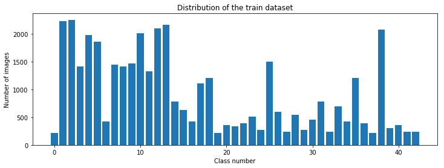

# Traffic Sign Classification using CNNs

In this project I have used Python3,Numpy,Matplotlib,OpenCV,sklearn,Pickle,Tensorflow to build and train a Convolutional Neural Network that can
classify traffic sign from a given image with 95% accuracy. I have used the following approach to build this classifier

1. Loaded the German Traffic signs image dataset as train and test numpy arrays with labels.
2. Explored the dataset using numpy and matplotlib to find the number of unique classes, number of training and testing observations, 
   dimensions of the images and to get a visual feel of the images.
3. Plotted the distribution of images based on the output classes to find how the data is distributed.
4. Pre-processed the dataset by converting the images to grayscale and normalizing them such that they have zero mean and equal variance
5. From the distribution of images, I observed that the data for some classes is far too less compared to other classes, hence I have 
   augmented the dataset to generate some fake images from the existing images by doing some random scaling, translation, rotation, 
   increasing brightness and smoothing the images.
6. After adding the augmented data to the original dataset shuffled the dataset and split them into training and validation sets using sklearn
7. Saved the dataset to disk using pickle to avoid regenerating the augmented data.
8. Randomly checked the images after pre-processing and plotted the distribution.
9. Designed the Convolutional Neural Network with multiple Convolution, pooling and fully connected layers.
10. Experimented with multiple architectures, dropout, multiple kernel sizes, different types of padding and trained with different combinations
    of Epochs, batchsizes and learning rates.
11. Arrived at a working design with optimal hyper parameters that gave a training accuracy of 99% and Testing accuracy of 95%
12. Tested the model on new images found on web.

## Details of the approach and further explanation of steps

In this section I provide further details about each of the above steps and the reasoning behind them

### Data Set Summary & Exploration

I used numpy to explore the dataset. This Pickle dataset is a dictionary with key value pairs. 
1. **features** key contains the images as values in 4D array in pixels of dimesions (**num.of observations**X**width**X**height**X**color channels**)
2. **labels** key contains the classification of the traffic sign as values in 2D array of dimensions (**num.of observations**X**class**)

As the original validation set given in the dataset is less than 20% of the training set, I have put it back into training set and had
later split the training and validation set to keep them in the raio of 80:20

```
X_train_orig, y_train_orig = train['features'], train['labels']
X_valid_orig, y_valid_orig = valid['features'], valid['labels']
#Concatenating Training and validation data as the original validation data is less than 20% of training data
X_train = np.concatenate((X_train_orig,X_valid_orig))
y_train = np.concatenate((y_train_orig,y_valid_orig))
```

```
n_train = len(y_train)
n_test = len(y_test)
image_shape = X_train.shape
n_classes = len(np.unique(y_train))
```

Number of training examples = 39209   
Number of testing examples = 12630  
Image data shape = (39209, 32, 32, 3)  
Number of classes = 43  

Here is a visualization of a sample image from each class achieved using the following code snippet

```
import matplotlib.pyplot as plt
%matplotlib inline

num_of_samples=[]
plt.figure(figsize=(10, 16.5))
for i in range(0, n_classes):
    plt.subplot(11, 4, i+1)
    x_select = X_train[y_train == i]
    plt.imshow(x_select[0, :, :, :]) #draw the first image of each class
    plt.title(i)
    plt.axis('off')
    num_of_samples.append(len(x_select))
plt.show()
```


Here is the distribution of training images based on the output classes achieved using the following code snippet

```
plt.figure(figsize=(12, 4))
plt.bar(range(0, n_classes), num_of_samples)
plt.title("Distribution of the train dataset")
plt.xlabel("Class number")
plt.ylabel("Number of images")
plt.show()
```



### Design and Test a Model Architecture

#### 1. How I preprocessed the image data. What techniques were chosen and why did I chose these techniques? 

Images from the sample dataset are in color (have all three dimensions RGB), I have converted them to gray scale as it will reduce the
memory requirement and also speed up the training without loosing any needed details. 

After converting them to gray scale, I have normalized the data by substracting 128 from each pixel value and dividing it by 128. This will ensure that the all the features in the input will have zero mean and equal variance.

Few advantages of normalizing the data are:

1. It makes your training faster.
2. It prevents you from getting stuck in local optima.

```
# Convert to grayscale
X_train_rgb = X_train
X_train_gry = np.sum(X_train/3, axis=3, keepdims=True)

X_test_rgb = X_test
X_test_gry = np.sum(X_test/3, axis=3, keepdims=True)

X_train = X_train_gry
X_test = X_test_gry

#Normalize
X_train_norm = (X_train - 128)/128
X_test_norm = (X_test -128)/128
```
Here is an example of a traffic sign image before and after grayscaling.


From the distribution of images, I observed that the data for some classes is far too less compared to other classes, hence I have augmented the dataset to generate some fake images from the existing images by doing some random scaling, translation, rotation, increasing brightness and smoothing the images.

```
def random_translate(img):
    """Applies translation up to px pixels in x and y directions"""
    rows,cols,_ = img.shape
    px = 2
    dx,dy = np.random.randint(-px,px,2)
    A = np.float32([[1,0,dx],[0,1,dy]])
    img_trns = cv2.warpAffine(img,A,(cols,rows))
    img_trns = img_trns[:,:,np.newaxis]
    return img_trns

def random_scale(img):
    """Scales image up to px pixels in x and y directions"""
    rows,cols,_ = img.shape
    # Pixel limits to transform
    px = np.random.randint(-2,2)
    # End Co-ordinates
    crds1 = np.float32([[px,px],[rows-px,px],[px,cols-px],[rows-px,cols-px]])
    # Starting Co-ordinates
    crds2 = np.float32([[0,0],[rows,0],[0,cols],[rows,cols]])
    P = cv2.getPerspectiveTransform(crds1,crds2)
    img_scl = cv2.warpPerspective(img,P,(rows,cols))
    img_scl = img_scl[:,:,np.newaxis]
    return img_scl

def gaussian_blur(img, kernel_size=3):
    """Applies a Gaussian Noise kernel"""
    img_smt = cv2.GaussianBlur(img, (kernel_size, kernel_size), 0)
    img_smt = img_smt[:,:,np.newaxis]
    return img_smt

def random_rotate(img):
    """Rotates image up to ang degrees """
    c_x,c_y = int(img.shape[0]/2), int(img.shape[1]/2)
    ang = 30.0*np.random.rand()-15
    R = cv2.getRotationMatrix2D((c_x, c_y), ang, 1.0)
    img_rot = cv2.warpAffine(img, R, img.shape[:2])
    img_rot = img_rot[:,:,np.newaxis]
    return img_rot

def random_brightness(img):
    shifted = img + 1.0   # shift to (0,2) range
    img_max_value = max(shifted.flatten())
    max_coef = 2.0/img_max_value
    min_coef = max_coef - 0.1
    coef = np.random.uniform(min_coef, max_coef)
    img_brgt = shifted * coef - 1.0
    return img_brgt

def random_warp(img):
    rows,cols,_ = img.shape
    # random scaling coefficients
    rndx = np.random.rand(3) - 0.5
    rndx *= cols * 0.06   # this coefficient determines the degree of warping
    rndy = np.random.rand(3) - 0.5
    rndy *= rows * 0.06
    # 3 starting points for transform, 1/4 way from edges
    x1 = cols/4
    x2 = 3*cols/4
    y1 = rows/4
    y2 = 3*rows/4
    pts1 = np.float32([[y1,x1],
                       [y2,x1],
                       [y1,x2]])
    pts2 = np.float32([[y1+rndy[0],x1+rndx[0]],
                       [y2+rndy[1],x1+rndx[1]],
                       [y1+rndy[2],x2+rndx[2]]])
    M = cv2.getAffineTransform(pts1,pts2)
    img_warp = cv2.warpAffine(img,M,(cols,rows))
    img_warp = img_warp[:,:,np.newaxis]
    return img_warp

def augment_img(img):
    """Image augumentation pipeline """
    img=random_translate(img)
    img=random_scale(img)
    img=random_rotate(img)
    img=random_brightness(img)
    img=random_warp(img)
    img_aug=gaussian_blur(img)
    return img_aug
 ```

One more reason why I wanted to infuse additional data into the dataset is to achieve the **Translation**, **Rotation**, **Size** and 
**Illumination** variance

Here is a comparison of gray scale image and augmented image


Here is how the distribution looks like after infusing augmented data


With all the pre-processing and data augmentation done, I now split the data into training and validation sets after shuffling

```
from sklearn.utils import shuffle
X_train, y_train = shuffle(X_train, y_train)
print('done')
```
```
print("Old X_train size:",len(X_train))
from sklearn.model_selection import train_test_split
X_train, X_valid, y_train, y_valid = train_test_split(X_train, y_train, 
                                                                test_size=0.20, random_state=42)
print("New X_train size:",len(X_train))
print("X_validation size:",len(X_valid))
```
Old X_train size: 54710   
New X_train size: 43768   
X_validation size: 10942   

```
print(np.mean(X_train))
print(np.mean(X_test))
print(np.mean(X_valid))
print(X_train.shape)
print(X_test.shape)
print(X_valid.shape)
print(y_train.shape)
```

-0.282008280784   
-0.358215153428    
-0.283820187786   
(43768, 32, 32, 1)   
(12630, 32, 32, 1)   
(10942, 32, 32, 1)   
(43768,)   


